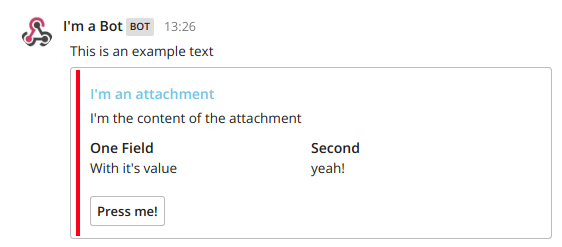

# Mattermost PHP

Mattermost PHP is a compilation of tools to help you develop Bots, webhooks or other applications for Mattermost.
It provides code to easily send complex messages to MM with Attachments, actions (buttons)... receive and parse webhooks and a simple wrapper to make bots.
Also there is an API connector under development (any help is appreciated via Pull request)

## Requirements and Install

MattermostBot could be installed via composser. 
`$ composer require eclaboratorio/mattermost-bot`

It requires php<=7.1 

# How to use Mattermost Bot
Here you could find some easy examples
## Send a message to Mattermost

```PHP
//Webhook url provided when you create a new slash command
$webhookUrl = 'https://yourMMserver.com/wooks/xxxxxxx';
$response = new \MattermostBot\Response();  
$response->setText("This is an example text");  
$response->setUsername("I'm a Bot");  
$response->setChannel("@isoria");  
//Create the attachment with it's options  
$attachment = new \MattermostBot\Attachment();  
$attachment->setTitle("I'm an attachment");  
$attachment->setText("I'm the content of the attachment");  
$attachment->setTitleLink("https://www.elconfidencial.com");  
$attachment->setColor("#ff0000");  
$attachment->addFieldByText("One Field","With it's value",true);  
$attachment->addFieldByText("Second","yeah!",true);  
//Add a button  
$action = new \MattermostBot\AttachmentAction();  
//The callback could be parsed with IncomingAction class  
$action->setUrl("https://example.com/webhookUrl/called-when-pressed");  
$action->setName("Press me!");  
//Values attached to context are sent to the button webhook and parsed by IncomingAction
$action->attachToContext("param1",'value1');  
$action->attachToContext("another_param",'asdf');  
//Add the button to the attachment  
$attachment->addAction($action);  
//Attach the attachment and send  
$response->addAttachment($attachment);  
$response->sendIncomming($webhookUrl);
```

## Receive a slash command
To parse a Incoming slash message just create a new IncomingSlash
```PHP
$message = new \MattermostBot\IncomingSlash();
```
| Var | Value |  
|--|--| 
| Text | $message->getText() | 
| Token | $message->getToken() | 
| UserName | $message->getUserName() | 
| Command | $message->getCommand() | 
| ChannelId | $message->getChannelId() | 
| ChannelName | $message->getChannelName() | 
| TeamDomain | $message->getTeamDomain() | 
| UserId | $message->getUserId() |
## Make a simple slash command bot

To simplify the development and implement some security good practices there's a bot wrapper
### Your webhook url
```PHP
$message = new \MattermostBot\IncomingSlash();
$allowedTokens = ['1ifucdyn1pb1cdz1bk8dmkiqjc'];
//Empty array means everybody could call the bot
//The usernames wothout the @
$allowedUsers = ['myuser'];
$bot = new TestBot($message, $allowedTokens, $allowedUsers);
if ($bot->execute() === false) {  
	echo "Bot execution fails";  
} else {
	echo "It works!";
}
```

### Bot File
 ```PHP
class TestBot extends \MattermostBot\BaseBot  
{ 
//Any bot should implement a process function. 
//It is call after checking the user is allowed to run the command  
protected function process()  
{
	$response = new \MattermostBot\Response();
	$response->setResponseType(\MattermostBot\Response::RESPONSE_IN_CHANNEL);  
	$response->setUsername("TestBot");
	$msg = "| Var | Value |  
	 | :------------ |:---------------|
	 | Text | {$this->message->getText()} | 
	 | Token | {$this->message->getToken()} | 
	 | UserName | {$this->message->getUserName()} | 
	 | Command | {$this->message->getCommand()} | 
	 | ChannelId | {$this->message->getChannelId()} | 
	 | ChannelName | {$this->message->getChannelName()} | 
	 | TeamDomain | {$this->message->getTeamDomain()} | 
	 | UserId | {$this->message->getUserId()} |";  
  
	$response->setText($msg);  
	$this->sendMessage($response);
}
```

 